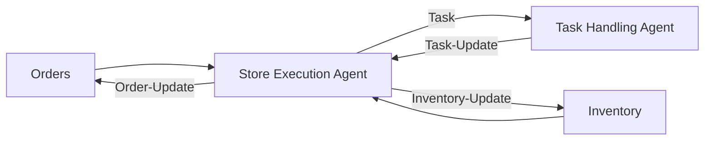
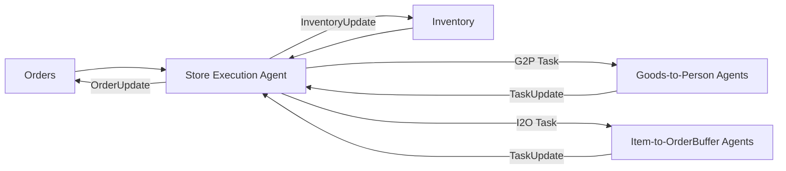

##Entities: 




>There could be multiple types (& numbers) of Task Handling Agents


##Lifecycle: 

```mermaid
sequenceDiagram
    participant ORDER SOURCE
    participant STORE EXECUTION AGENT
    participant ROR TASK_SPACE
    participant ROR EXECUTION_SPACE
    participant (BLACKBOX) FSM
    ORDER SOURCE ->> STORE EXECUTION AGENT: New Order
    loop Order Line Item
        STORE EXECUTION AGENT->>STORE EXECUTION AGENT: Check If Item Available In Inventory
    end
    STORE EXECUTION AGENT->>ROR TASK_SPACE: ROR_Task
    ROR TASK_SPACE->>ROR TASK_SPACE: Check if existing Job that can fulfill the Task
    ROR TASK_SPACE->>ROR TASK_SPACE: Assign Job

    ROR TASK_SPACE->>ROR EXECUTION_SPACE: ROR_Operation
    ROR TASK_SPACE->>ROR TASK_SPACE: Update JobSpace

    ROR EXECUTION_SPACE->>(BLACKBOX) FSM: modbus: set register
    ROR EXECUTION_SPACE->>(BLACKBOX) FSM: modbus: set coil
    (BLACKBOX) FSM->>ROR EXECUTION_SPACE: modbus: read register
    (BLACKBOX) FSM->>ROR EXECUTION_SPACE: modbus: read coil
    ROR EXECUTION_SPACE-->>ROR TASK_SPACE: Operation Update
        
    ROR TASK_SPACE->>ROR TASK_SPACE: Update JobSpace

    ROR TASK_SPACE-->>STORE EXECUTION AGENT: Task Update
    STORE EXECUTION AGENT->>STORE EXECUTION AGENT: Update Order Status
```