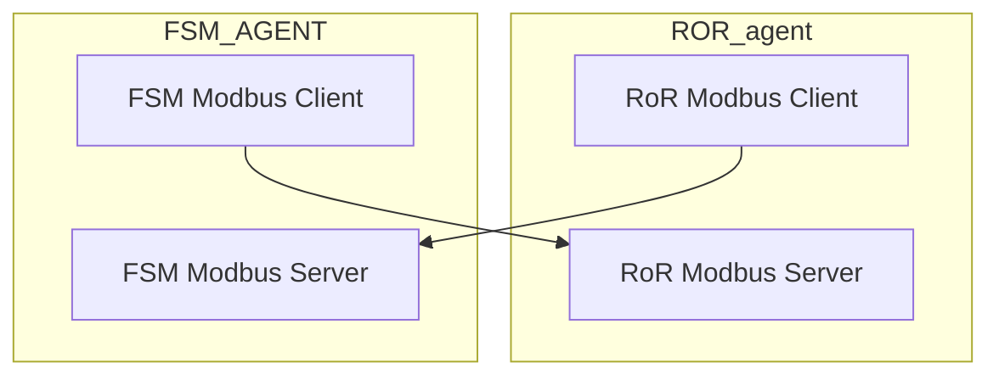

### Environment Variables
```text
DATABASE_URL=""
OPERATION_MAX_EXE_TIME=120000
LOCAL_MODBUS_HOST="127.0.0.1"
LOCAL_MODBUS_PORT=8503
LOCAL_MODBUS_ID=1
PLC_HOST="127.0.0.1"
PLC_PORT=8501
PLC_ID=255
SEED=true
```
- DATABASE_URL -> The url to mongodb ror agent
- OPERATION_MAX_EXE_TIME -> Max execution time for each operation
- LOCAL_MODBUS_HOST -> host name for modbus server
- LOCAL_MODBUS_PORT -> port for modbus server
- LOCAL_MODBUS_ID -> Id for modbus server
- PLC_HOST -> HOST FOR PLC
- PLC_PORT -> PORT FOR PLC
- PLC_ID -> id for PLC
- SEED -> to seed the data for first run it will be true then it can be set to false

## Connection Between ROR and FSM Agent

