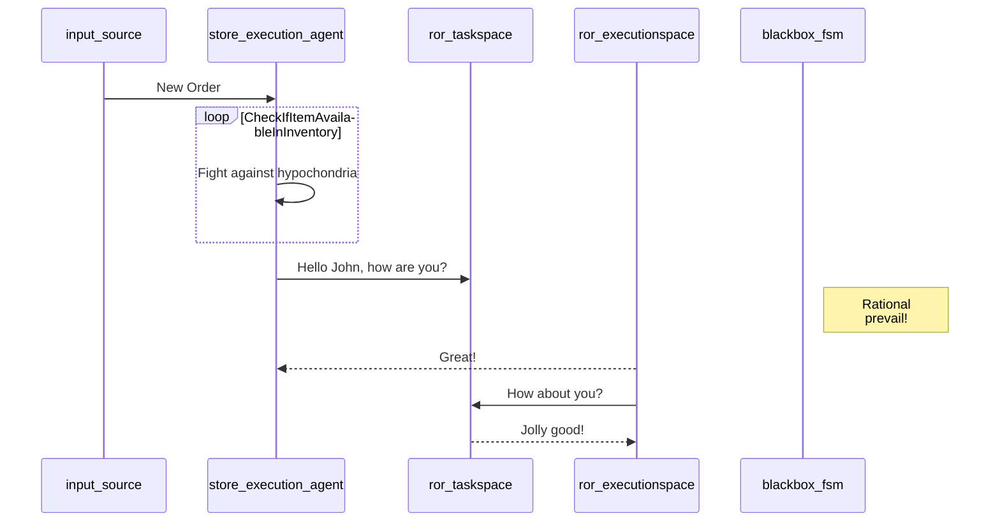
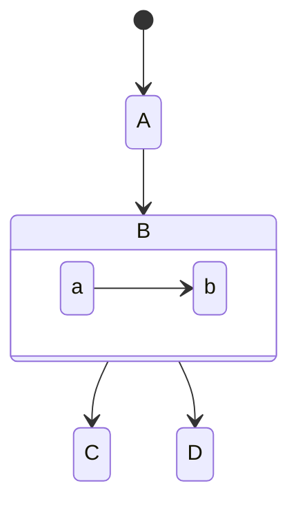
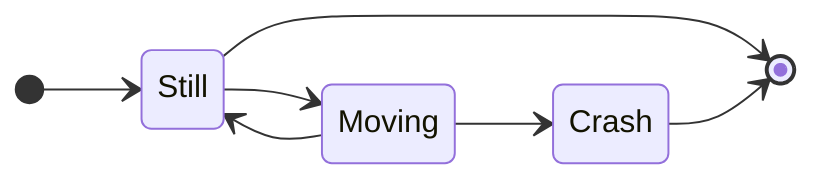

```mermaid
sequenceDiagram
    participant input_source
    participant store_execution_agent
    participant ror_taskspace
    participant ror_executionspace
    participant blackbox_fsm
    input_source ->> store_execution_agent: New Order
    loop CheckIfItemAvailableInInventory
        store_execution_agent->>store_execution_agent: Fight against hypochondria
    end
    store_execution_agent->>ror_taskspace: Hello John, how are you?
    Note right of blackbox_fsm: Rational <br/>prevail!
    ror_executionspace-->>store_execution_agent: Great!
    ror_executionspace->>ror_taskspace: How about you?
    ror_taskspace-->>ror_executionspace: Jolly good!
```

```mermaid
stateDiagram
    [*] --> A
    A --> B
    B --> C
    state B {
      direction LR
      a --> b
    }
    B --> D
```

```mermaid
stateDiagram-v2
    direction LR
    [*] --> Still
    Still --> [*]
    Still --> Moving
    Moving --> Still
    Moving --> Crash
    Crash --> [*]
```