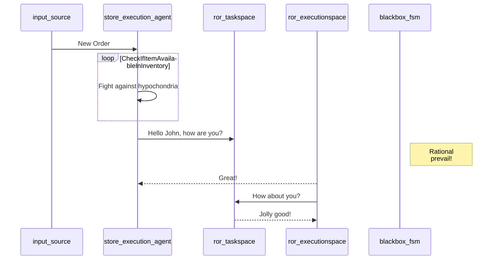
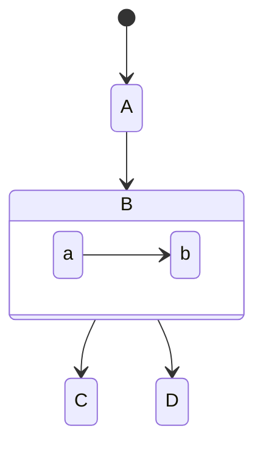
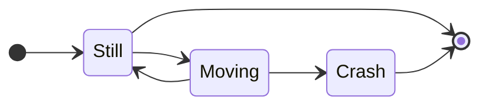
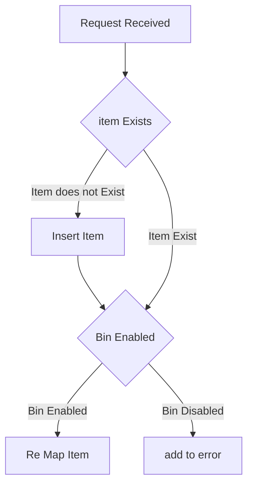

## Dispense Request
This request will Dispense the order.
sample json payload which can be sent using api-tester app

```json
{
    "interface": "@drona/store-execution-agent:::CreateOrUpdateOrder",
    "token": "",
    "request": {
        "request_uid": "E1F5d35eEBa83cAd58a453fc",
        "request_type": "normal",
        "pharmacy_key": null,
        "return_status": 0,
        "order_value": null,
        "client": {
            "uid": "wFnAwZr1x@Qlwha3PI0LnuBfX,FbBX",
            "name": "Dhsgwbuymeuz Ddqqm",
            "gender": "M",
            "age_group": "84-89",
            "phone": null,
            "email": "wFnAwZr1x@Qlwha3PI0LnuBfX,FbBX",
            "ehrs": []
        },
        "prescribed_items": [
            {
                "item_code": "M-N-PH-I004-00415",
                "quantity": 1
            },
            {
                "item_code": "M-N-PH-P006-00007",
                "quantity": 6
            }
        ],
        "prescriber": {
            "uid": "ISYcOPDYbokEUKdCdlwx@0GicZj1eAzPAvj4wYGHF",
            "name": "Unnurnkpojm Trwg",
            "email": "ISYcOPDYbokEUKdCdlwx@0GicZj1eAzPAvj4wYGHF",
            "department": null
        },
        "operator_staff": {
            "uid": "mIYotqkbxdyhN@E5UhdZEZ5vBi]pI",
            "name": "Crbvofa Myvtmxppd",
            "email": "mIYotqkbxdyhN@E5UhdZEZ5vBi]pI"
        },
        "originator": "dronaapitester"
    }
}
```

when this request is sent the robot will try to dispense the prescribed items

#### Ideal Behaviour 
1. request is received then items in request are checked if they are present in the robot inventory
2. after that robot will try to check if the item present in the inventory is present in the bin which is functional if the item is present in the disabled bin then it will not take the request for that item. the requested item which is present in the enabled bin the dispensing process will start for that


## Disable Bin Request
This request will disable the bin number which is being provided
sample json payload which can be sent using api-tester app
```json
{
    "interface": "@drona/store-execution-agent:::DisableBin",
    "token": "",
    "request": {
        "request_uid": null,
        "request_type": "normal",
        "storeKey": null,
        "operator_staff": {
            "uid": null,
            "name": null,
            "email": null
        },
        "inventoryConfig": {
            "bins": [
                {
                    "bin_uid": "Bin 5",
                    "isFunctional": false
                }
            ]
        },
        "sender": {}
    }
}
```

When this request is sent the robot will disable the bin number which is provided 

#### Ideal Behaviour
1. when the request is received it takes all the bin uid which is provided in the request and it will disable those bins


## Re-Configure Inventory
This request will re-assign the items to the specific bin numbers

```json
{
    "interface": "@drona/store-execution-agent:::ReconfigureInventory",
    "token": "",
    "request": {
        "request_uid": null,
        "request_type": "normal",
        "storeKey": null,
        "operator_staff": {
            "uid": null,
            "name": null,
            "email": null
        },
        "inventoryConfig": {
            "autoTrayAssignment": false,
            "items": [{
                    "item_code": "M-N-PH-Z002-00049",
                    "uid": "M-N-PH-Z002-00049",
                    "human_readable_name": "MERCAPTOPURINE-TABLET-50MG-6 MP-",
                    "brand": "6 MP-",
                    "category": "tablet",
                    "tray_id":"Bin 5"
                }]
        },
        "sender": {}
    }
}
```

This request will override the values in the given tray id

#### Ideal Behaviour
1. When the request is received the items provided will be checked that if exists in inventory db.
2. if exists then it will check if the bin to which it is assigned is enabled or not if the bin is enabled then the item will be re configured to that.
else an error will be thrown
3. if item does not exist then it will first insert the item to the db then it will assign that item to the specified bin.

