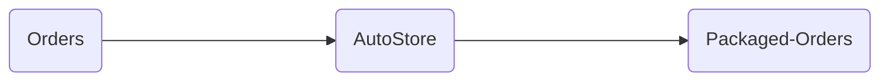
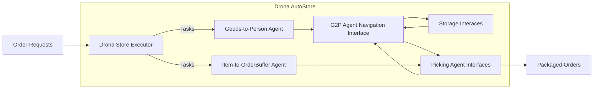

A Drona AutoStore Instance is composed of the following : 

1. Drona Store Executor
> microservice managing the inventory & orders, sending & monitoring tasks to other agents.

2. Goods2Person Agent(s)
> a pair of 2 microservices & a black-box interface constituting the robot that moves totes/cases between storage & picking-agent interfaces.

3. Storage Interface(s)
> the tote/case storage infrastructure, constituting the goods2person agent's workspace.

4. G2P Agent Navigation Interface
> the infrastructure used by goods2person agent to navigate its workspace.

5. Picking-Agent Interface(s)
> the buffer storage infrastructure where totes are delivered to & returned from, constituting the goods2person agent's workspace as well as the item-picking agent's workspace.

6. Item-to-OrderBuffer Agent(s)
> currently the human agent that picks items from totes/cases into order-buffers at the picking-agent interface.
 

