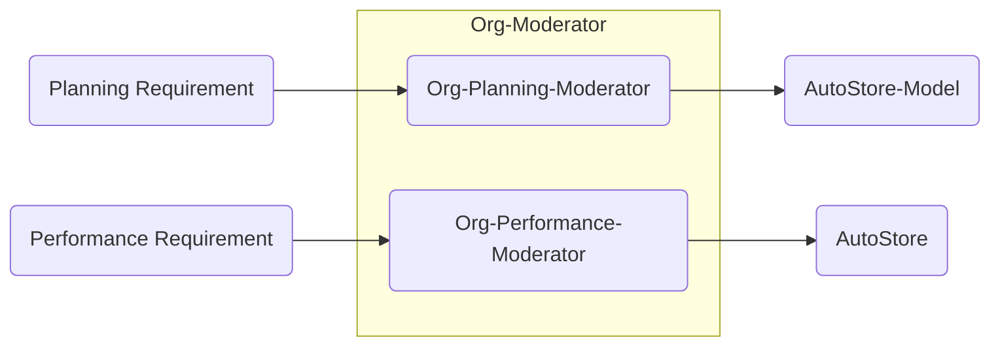

##Overview

```mermaid
graph LR
  INP1-OM(Planning Requirement) --> OPLM(Org-Planning-Moderator)
  INP2-OM(Performance Requirement) --> OPEM(Org-Performance-Moderator)
  OPEM --> OUT-OPEM(AutoStore)
  OPLM --> OUT-OPLM(AutoStore-Model)
  subgraph Org-Moderator
    OPLM;
    OPEM;
  end

```