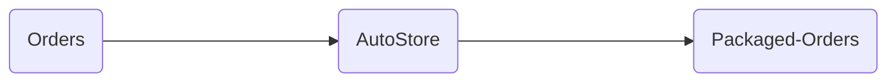
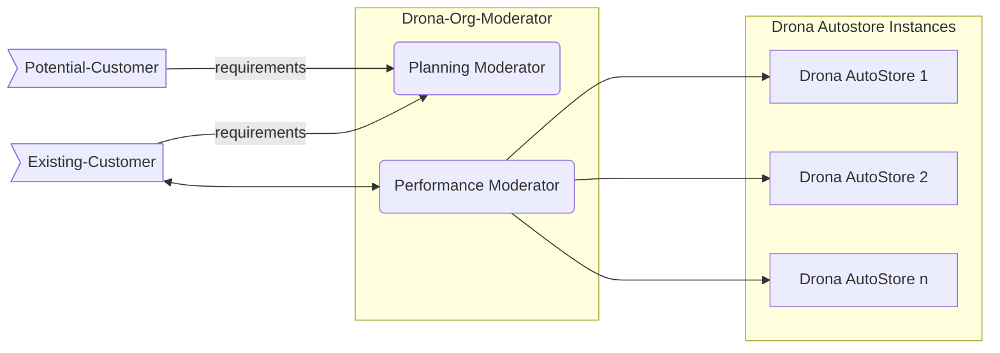
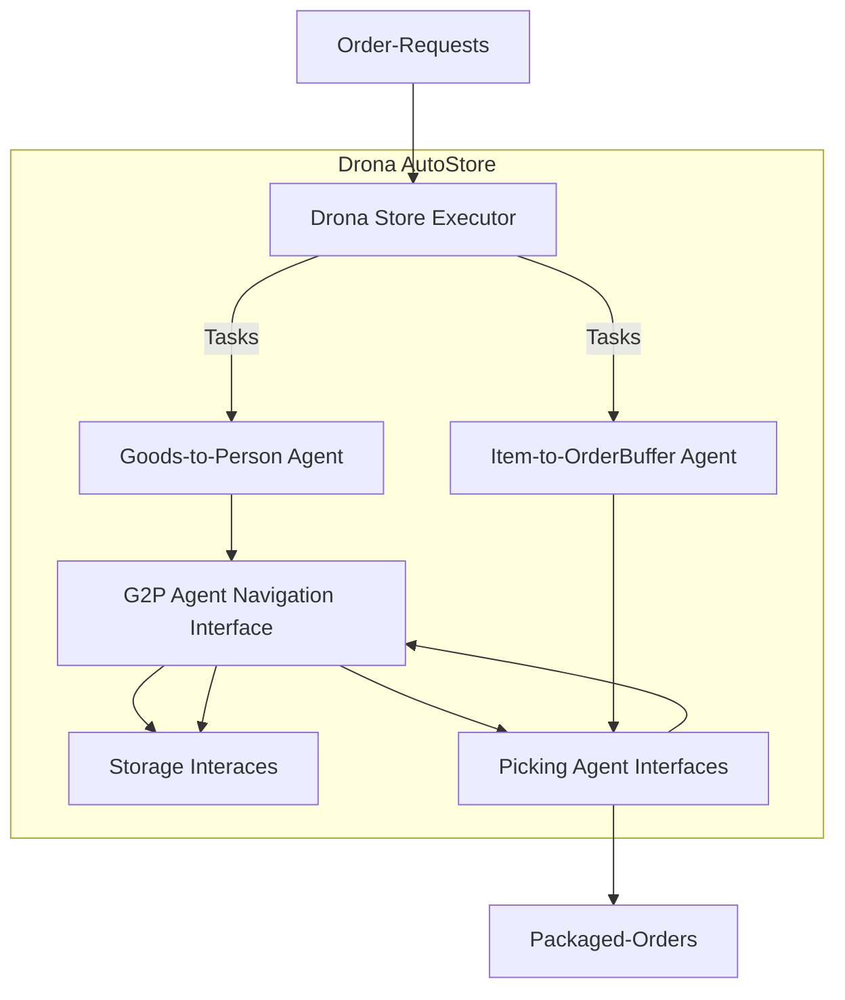

##DRONA

1. AutoStore
> robot-driven mini-load storage & fulfillment system.  

  
2. Org Moderator
> the org-level management system for planning new stores or moderating performance of existing stores in the org.

##Drona AutoStore *(or just 'Autostore')*  

An Autostore Instance is composed of the following : 

1. Store Executor
> microservice managing the inventory & orders, sending & monitoring tasks to other agents.

2. Goods2Person Agent(s)
> a pair of 2 microservices & a black-box interface constituting the robot that moves totes/cases between storage & picking-agent interfaces.

3. Storage Interface(s)
> the tote/case storage infrastructure, constituting the goods2person agent's workspace.

4. G2P Agent Navigation Interface
> the infrastructure used by goods2person agent to navigate its workspace.

5. Picking-Agent Interface(s)
> the buffer storage infrastructure where totes are delivered to & returned from, constituting the goods2person agent's workspace as well as the item-picking agent's workspace.

6. Item-to-OrderBuffer Agent(s)
> currently the human agent that picks items from totes/cases into order-buffers at the picking-agent interface.
 

##Org Moderator :  
> *deployed separately for each org(customer), example - * 
> *Demo Org: *<a target="_blank" href="https://demo-org.drona.footloose.io/">
	*demo-org.drona.footloose.io*
  </a> 

Org Moderator is composed of the following : 

1. Org-Planning Moderator : 
> helps plan new stores based on models & metrics generated against requirements in realtime.  

2. Org-Performance Moderator : 
> helps modearate performance of existing stores.  

##Org-Planning Moderator
1. Visit drona.footloose.io  
2. Configure Requirements  
> no of ASUs  
> order throughput & frequency  
> tote size  
> no of picking/counter staff  
> type of fulfilment (choose from list)  
> spatial constraints (length, breadth & height)  
	3. Review Cost & Performance of the Generated Model  
> setup costs  
> &nbsp;&nbsp;&nbsp; no of goods2person robots  
> &nbsp;&nbsp;&nbsp; no of picking-interfaces  
> spatial footprint  
> &nbsp;&nbsp;&nbsp; no of aisles & levels  
> operation costs  
> performance  
> &nbsp;&nbsp;&nbsp; mean order time  
> &nbsp;&nbsp;&nbsp; no of orders per day & per hour  

##Org-Performance Moderator
